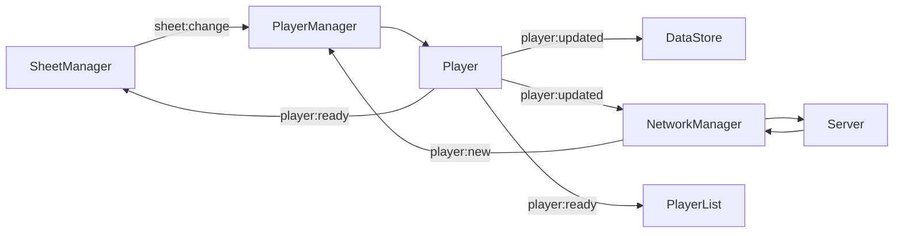

Event: player:new
Description: nouveau joueur reçu depuis le réseau
Payload:
{
  id: UUID,
  sheet: Sheet
}

Event: player:ready
Description: joueur prêt après initialisation
Payload:
{
  id: UUID,
  sheet: Sheet
}

Event: sheet:change
Description: modification d'un champ de la fiche
Payload:
{
  id: UUID,
  key: String,
  value: Any
}

Event: player:updated
Description: données joueur mises à jour
Payload:
{
  id: UUID,
  sheet: Sheet
}

Event: skills:changed
Description: Changement du nombre de compétences séléctionnez
Payload:
Number

Event: roll:start
Description: données d'un jet de dé
Payload:
{
  Label: "Vigueur",
  dice: this.dice,
  result:this.highest().value,
  sheet:this.playerLocal.sheet
}

## [INITIALISATION LOCALE]

1. DataStore >emit> [player:new] >listen> PlayerManager >create> Player >emit> [player:ready] >listen> Sheet
                                                                                                   >listen> NetworkManager

## [UPDATE LOCAL]

2. SheetManager >emit> [sheet:change] >listen> PlayerManager >dispatch> Player >emit> [player:updated] >listen> DataStore >save> localStorage
                                                                                                       >listen> NetworkManager >broadcast> Server > 3.

## [UPDATE DISTANT]

3. Server >broadcast> NetworkManager >emit> [player:new] >listen> PlayerManager >dispatch> Player >emit> [player:ready] >listen> Sheet (for player user) >dispatch> PlayerList
                                                                                                                        >listen> SheetManager(for GM user) >dispatch> Sheet

